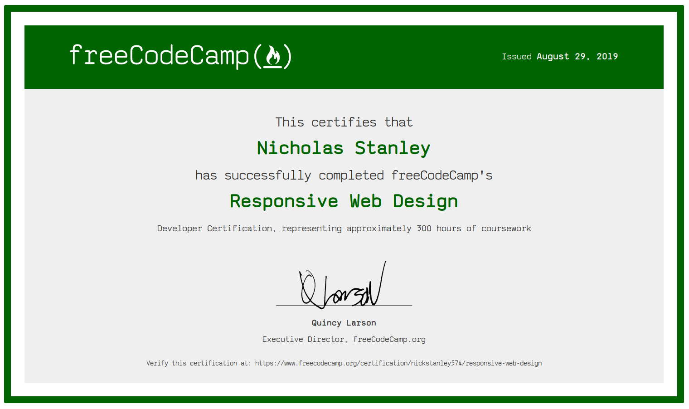
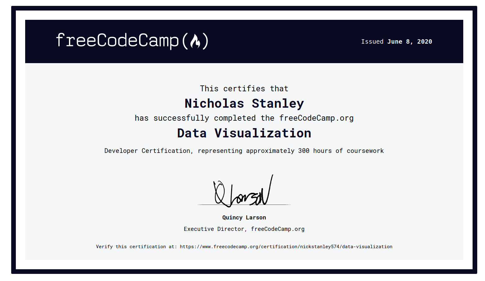
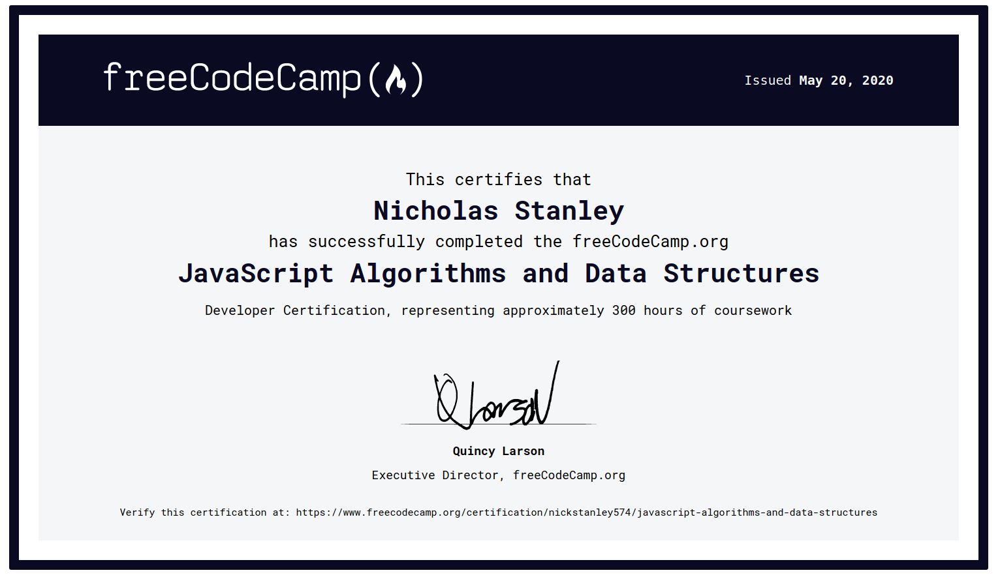
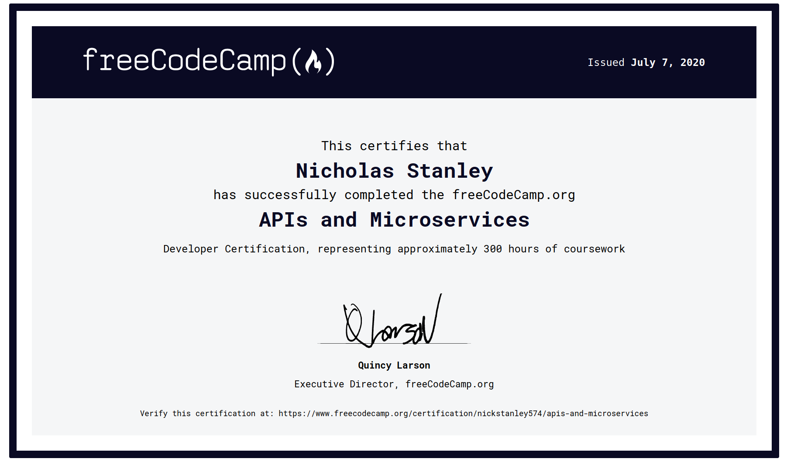

# FreeCodeCamp Projects

Certification Homepage: [fcc-responsivewebdesign-ns574](https://freecodecamp-projects-ns574.herokuapp.com/)

GitHub: [nickstanley574/freeCodeCampProjects/](https://github.com/nickstanley574/freeCodeCampProjects/)

I decided to spend the time doing FreeCodeCamp certification for three reasons.

First, is I have noticed a lot of Node, React, JavaScript, essentially Frontend developers are being hired with no formal coding training. Instead they have a code bootcamp and freeCodeCamp listed in their education. Wanting to see what more more self starter developers are using to learn I wanted to keep with the times and do the certification myself.

Second, I am not a frontend developers. Most of the html pages I have made have been basic black and white lines and text to display information has fast and simply has possible. Its time that I expand my frontend skills and have the skills to add a little personality to my webpages.

Third, I am not a app developer, but  I support fronted pipelines, testing process and generic software operations. I believe that every developer should know the basics and best practices around software operations and the inverse is also true. Every DevOps/Operations engineer should no the basics and brest practices of the application language they are supporting.

## Responsive Web Design Certification

GitHub: [nickstanley574/freeCodeCampProjects/ResponsiveWebDesign/](https://github.com/nickstanley574/freeCodeCampProjects/tree/master/ResponsiveWebDesign)

* [#1 Build a Tribute Page](https://freecodecamp-projects-ns574.herokuapp.com/ResponsiveWebDesign/Build-a-Trubute-Page/)
* [#2 Build a Survey Form](https://freecodecamp-projects-ns574.herokuapp.com/ResponsiveWebDesign/Survey-Form/)
* [#3 Build a Product Landing Page](https://freecodecamp-projects-ns574.herokuapp.com/ResponsiveWebDesign/Product-Landing-Page/)
* [#4 Build a Technical Documentation Page](https://freecodecamp-projects-ns574.herokuapp.com/ResponsiveWebDesign/Technical-Documentation-Page/)
* [#5 Build a Personal Portfolio Webpage](https://freecodecamp-projects-ns574.herokuapp.com/ResponsiveWebDesign/PersonalPortfolioWebpage/)

    

## Front End Libraries Certification

GitHub: [nickstanley574/freeCodeCampProjects/FrontEndLibraries/](https://github.com/nickstanley574/freeCodeCampProjects/tree/master/FrontEndLibraries)

* [#1 Random Quote Machine](https://freecodecamp-projects-ns574.herokuapp.com/FrontEndLibraries/RandomQuoteMachine/)
* [#2 Markdown Previewer](https://freecodecamp-projects-ns574.herokuapp.com/FrontEndLibraries/MarkdownPreviewer/)
* [#3 Drum Machine](https://freecodecamp-projects-ns574.herokuapp.com/FrontEndLibraries/DrumMachine/)
* [#4 JavaScript Calculator](https://freecodecamp-projects-ns574.herokuapp.com/FrontEndLibraries/JavaScriptCalculator/)
* [#5 Pomodoro Clock](https://freecodecamp-projects-ns574.herokuapp.com/FrontEndLibraries/PomodoroClock/)

    

## Data Visualization Certification

GitHub: [nickstanley574/freeCodeCampProjects/FrontEndLibraries/](https://github.com/nickstanley574/freeCodeCampProjects/tree/master/FrontEndLibraries)

* [#1 Visualize Data with a Bar Chart](https://freecodecamp-projects-ns574.herokuapp.com/DataVisualization/VisualizeDataBarChart/)
* [#2 Visualize Data with a Scatterplot Graph](https://freecodecamp-projects-ns574.herokuapp.com/DataVisualization/VisualizeDataScatterplotGraph/)
* [#3 Visualize Data with a Heat Map](https://freecodecamp-projects-ns574.herokuapp.com/DataVisualization/VisualizeDataHeatMap/)
* [#4 Visualize Data with a Choropleth Map](https://freecodecamp-projects-ns574.herokuapp.com/DataVisualization/VisualizeChoroplethMap/)
* [#5 Visualize Data with a Treemap Diagram](https://freecodecamp-projects-ns574.herokuapp.com/DataVisualization/VisualizeDataTreemapDiagram/)

    

## JavaScript Algorithms DataStructures

    

## APIs and Microservices

GitHub: [nickstanley574/freeCodeCampProjects/APIsAndMicroservices/](https://github.com/nickstanley574/freeCodeCampProjects/tree/master/APIsAndMicroservices)

* [#1 Timestamp Microservice](https://fcc-timestamp-ns574.herokuapp.com)
* [#2 Request Header Parser Microservice](https://fcc-header-parser-ns574.herokuapp.com)
* [#3 URL Shortener Microservice](https://fcc-urlshortener-ns574.herokuapp.com)
* [#4 Exercise Tracker](https://fcc-exercisetracker-ns574.herokuapp.com)
* [#5 File Metadata Microservice](https://fcc-filemetadata-ns574.herokuapp.com)

    

